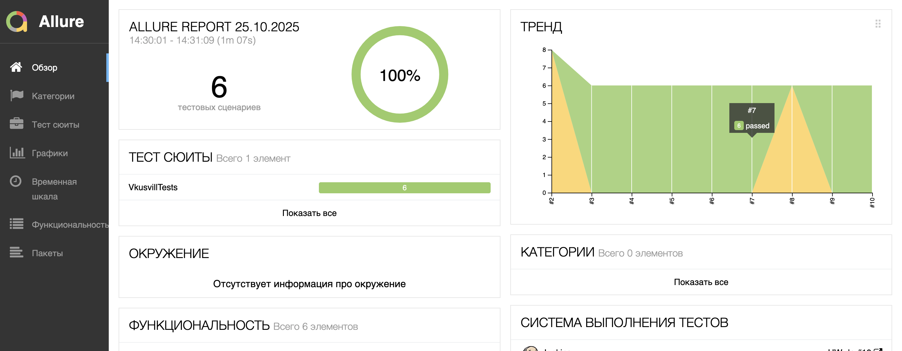
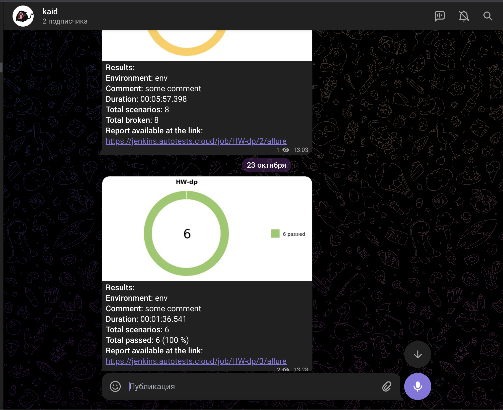

<a id="cases"></a>
## <a name="Примеры автоматизированных тест-кейсов">**Примеры автоматизированных тест-кейсов:**</a>
---

- ✓ *Проверка работы Поп-апа Меню*
- ✓ *Проверка работы Поп-апа Каталог*
- ✓ *Проверка перехода на страницу рецептов*
- ✓ *Проверка перехода на страницу Корзины*
- ✓ *Проверка перехода на страницу вакансий*


---

<a id="jenkins"></a>
##  Сборка в [Jenkins](https://jenkins.autotests.cloud/job/HW-dp/)

---

<p align="center">  
<a href="https://jenkins.autotests.cloud/job/HW-dp/"></a>  
</p>


### **Параметры сборки в Jenkins:**

- *BROWSER (браузер, по умолчанию chrome)*
- *VERSION (версия браузера, по умолчанию 126)*
- *SIZE (размер окна браузера, по умолчанию 1920x1080)*
- *REMOTEURL (адрес хоста для удалённого запуска тестов)*


<a id="console"></a>
## Команды для запуска из терминала
---

***Локальный запуск:***
```bash  
gradle clean vkusvill_test
```
```bash  
gradle clean test
```

***Удалённый запуск через Jenkins:***
```bash  
clean 
vkusvill 
"-Dbrowser=${BROWSER}" 
"-DbrowserSize=${SIZE}" 
"-DbrowserVersion=${VERSION}" 
"-DremoteUrl=${REMOTEURL}"
```

---

<a id="allure"></a>
## </a> <a name="Allure"></a>Allure [отчет](https://jenkins.autotests.cloud/job/HW-dp/allure/)</a>
---

### *Основная страница отчёта*

<p align="center">  
  
</p>  

### *Тест-кейсы*

<p align="center">  
  
</p>

### *Графики*

  <p align="center">  


</p>

---

<a id="allure-testops"></a>
## </a>Интеграция с <a target="_blank" href="https://allure.autotests.cloud/project/4974/dashboards">Allure TestOps</a>
---

### *Авто тест-кейсы*

<p align="center">  
  
</p>

---

<a id="telegram"></a>
## </a> Уведомление в Telegram при помощи бота
---

<p align="center">  
  
</p>

---

<a id="video"></a>
## </a> Примеры видео выполнения тестов на Selenoid
---

<p align="center">


   
</p>


